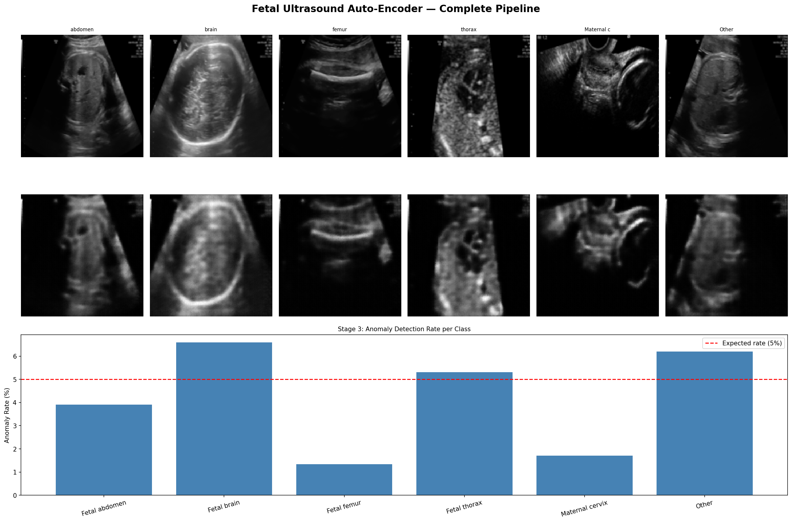

# Fetal Ultrasound Auto-Encoder

A deep learning project for learning compressed representations of 
fetal ultrasound images using convolutional auto-encoders, with a 
downstream classifier for standard scan plane detection.

## Pipeline Overview




## Dataset

[FETAL_PLANES_DB](https://zenodo.org/records/3904280) — 12,400 labeled 
maternal-fetal ultrasound images across 6 classes:
- Fetal abdomen
- Fetal brain  
- Fetal femur
- Fetal thorax
- Maternal cervix
- Other

## Project Structure

    fetal-ultrasound-ae/
    ├── src/
    │   ├── dataset.py    # custom Dataset class
    │   ├── model.py      # Encoder, Decoder, AutoEncoder, Classifier
    │   ├── train.py      # training loops, save/load, visualisation
    ├── notebooks/
    │   └── exploration.ipynb  # EDA and training experiments
    ├── results/           # saved model weights
    └── requirements.txt

## Results

### Stage 1 — Auto-Encoder Reconstruction
Trained for 20 epochs on 7,129 images. 16x compression ratio.

| Input | Compressed | Reconstructed |
|-------|-----------|---------------|
| 1×128×128 = 16,384 numbers | 16×8×8 = 1,024 numbers | 1×128×128 |

### Stage 2 — Scan Plane Classification

| Class | Train F1 | Test F1 |
|-------|----------|---------|
| Fetal abdomen | 0.45 | 0.37 |
| Fetal brain | 0.91 | 0.89 |
| Fetal femur | 0.75 | 0.69 |
| Fetal thorax | 0.80 | 0.76 |
| Maternal cervix | 0.96 | 0.94 |
| Other | 0.79 | 0.52 |
| **Overall accuracy** | **81%** | **71%** |

### Stage 3 — Anomaly Detection

Using reconstruction error as anomaly score. Threshold set at 95th 
percentile of training errors.

| Class | Anomaly Rate |
|-------|-------------|
| Fetal femur | 1.3% |
| Maternal cervix | 1.7% |
| Fetal abdomen | 3.9% |
| Fetal thorax | 5.3% |
| Other | 6.2% |
| Fetal brain | 6.6% |

Highest anomaly rate in Fetal brain images — consistent with 
clinical importance of brain anomaly detection.

### Stage 4 — Synthetic Data Augmentation (CVAE)

Generated 500 synthetic Fetal Abdomen images using CVAE.
Combined with real training data (7,129 + 500 = 7,629 images).

| Metric | Real only | Real + Synthetic | Change |
|--------|-----------|------------------|--------|
| Overall accuracy | 54% | 67% | +13% |
| Fetal brain F1 | 0.62 | 0.85 | +0.23 |
| Fetal femur F1 | 0.02 | 0.62 | +0.60 |
| Fetal thorax F1 | 0.19 | 0.58 | +0.39 |
| Fetal abdomen F1 | 0.21 | 0.15 | -0.06 |

Finding: Synthetic augmentation improves overall accuracy significantly.
Sharper synthetic images (WGAN-GP/Diffusion) expected to improve further.

## Setup

```bash
git clone https://github.com/lolorikos/fetal-ultrasound-ae
cd fetal-ultrasound-ae
pip install -r requirements.txt
```

Download the dataset from [Zenodo](https://zenodo.org/records/3904280) 
and place it in the `data/` folder.

## Approach

1. **Unsupervised pre-training** — train a convolutional auto-encoder 
   to learn compressed representations of ultrasound images without labels
2. **Supervised fine-tuning** — add a classification head and fine-tune 
   the entire network using labelled scan plane data
3. **Class imbalance handling** — weighted CrossEntropyLoss to handle 
   the heavily imbalanced class distribution

## Requirements
- Python 3.11+
- PyTorch
- torchvision
- pandas
- scikit-learn
- matplotlib
- tqdm
